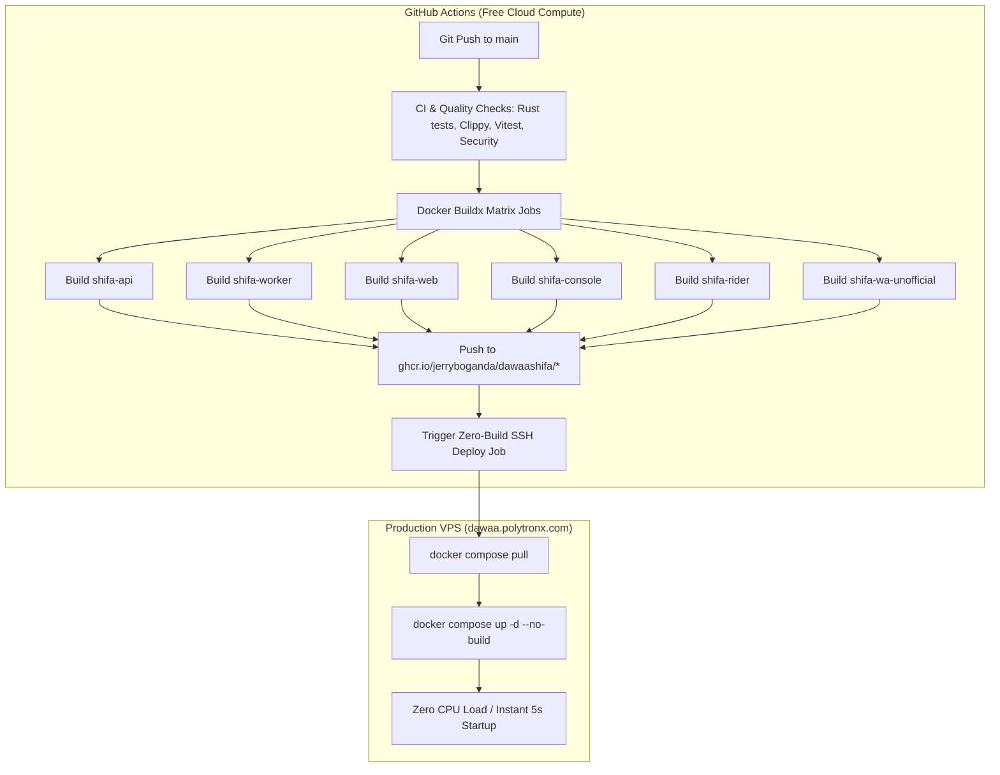

# Design Spec: Zero-Build VPS Deployment & GitHub Actions Compute Offloading

**Date**: 2026-08-21  
**Target Domain**: `dawaa.polytronx.com`  
**Registry**: GitHub Container Registry (`ghcr.io/jerryboganda/dawaashifa/*`)  
**Repo Visibility**: Public  

---

## 1. Problem Statement & Motivation
Currently, when a commit is pushed to `main`, GitHub Actions connects to the production VPS via SSH and runs `docker compose up -d --build`. This triggers multi-crate Rust release compilation (`cargo build --release`) and multi-app frontend bundling (`pnpm -r build`) directly on the production VPS CPU and RAM. 

This causes:
- 100% CPU spikes on the VPS for 5–15 minutes during every deployment.
- Severe memory pressure leading to risk of OOM kills on live PostgreSQL, Redis, and NATS services.
- Latency spikes and dropped connections for active customer webhooks and API requests.

---

## 2. Architecture & Target State



---

## 3. Detailed Component Design

### 3.1 GitHub Container Registry (GHCR) Publishing
GitHub Actions will authenticate using the automatic `${{ secrets.GITHUB_TOKEN }}` and push standard OCI container images:
- `ghcr.io/jerryboganda/dawaashifa/api:latest` & `:sha-<SHA>`
- `ghcr.io/jerryboganda/dawaashifa/worker:latest` & `:sha-<SHA>`
- `ghcr.io/jerryboganda/dawaashifa/web:latest` & `:sha-<SHA>`
- `ghcr.io/jerryboganda/dawaashifa/console:latest` & `:sha-<SHA>`
- `ghcr.io/jerryboganda/dawaashifa/rider:latest` & `:sha-<SHA>`
- `ghcr.io/jerryboganda/dawaashifa/wa-unofficial:latest` & `:sha-<SHA>`

Docker Buildx layer caching (`type=gha`) is enabled for every image, ensuring re-builds in GitHub Actions take less than 1–2 minutes.

### 3.2 Production Compose (`deploy/docker-compose.prod.yml`)
Each service will use the pre-built GHCR image:
```yaml
web:
  image: ghcr.io/jerryboganda/dawaashifa/web:${IMAGE_TAG:-latest}
console:
  image: ghcr.io/jerryboganda/dawaashifa/console:${IMAGE_TAG:-latest}
rider:
  image: ghcr.io/jerryboganda/dawaashifa/rider:${IMAGE_TAG:-latest}
api:
  image: ghcr.io/jerryboganda/dawaashifa/api:${IMAGE_TAG:-latest}
worker:
  image: ghcr.io/jerryboganda/dawaashifa/worker:${IMAGE_TAG:-latest}
wa-unofficial:
  image: ghcr.io/jerryboganda/dawaashifa/wa-unofficial:${IMAGE_TAG:-latest}
```
The VPS performs **zero builds**.

### 3.3 Zero-Build Deployment Workflow (`.github/workflows/deploy.yml`)
The deployment job will run:
```bash
docker compose -f docker-compose.prod.yml pull
docker compose -f docker-compose.prod.yml up -d --no-build --remove-orphans
```
Execution time on VPS drops from ~10–15 minutes to ~5–10 seconds.

---

## 4. Verification Plan
1. **GitHub Actions Workflow Syntax**: Validate `.github/workflows/deploy.yml` structure.
2. **Local / Docker Compose validation**: Run `docker compose -f deploy/docker-compose.prod.yml config` to verify valid syntax and image variable resolution.
3. **CI Continuity**: Verify that `.github/workflows/verify.yml` and `.github/workflows/ci.yml` continue to pass without warnings.
